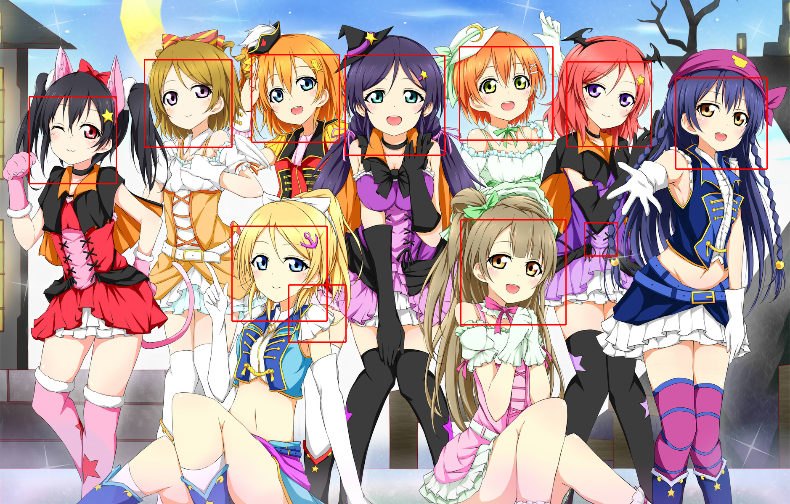
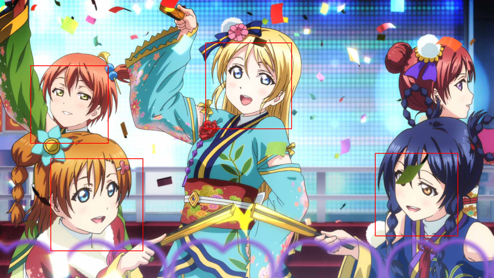
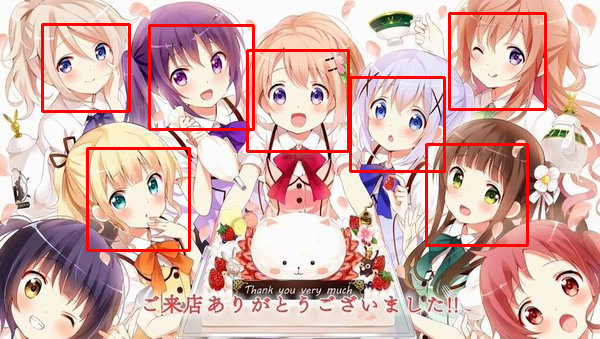
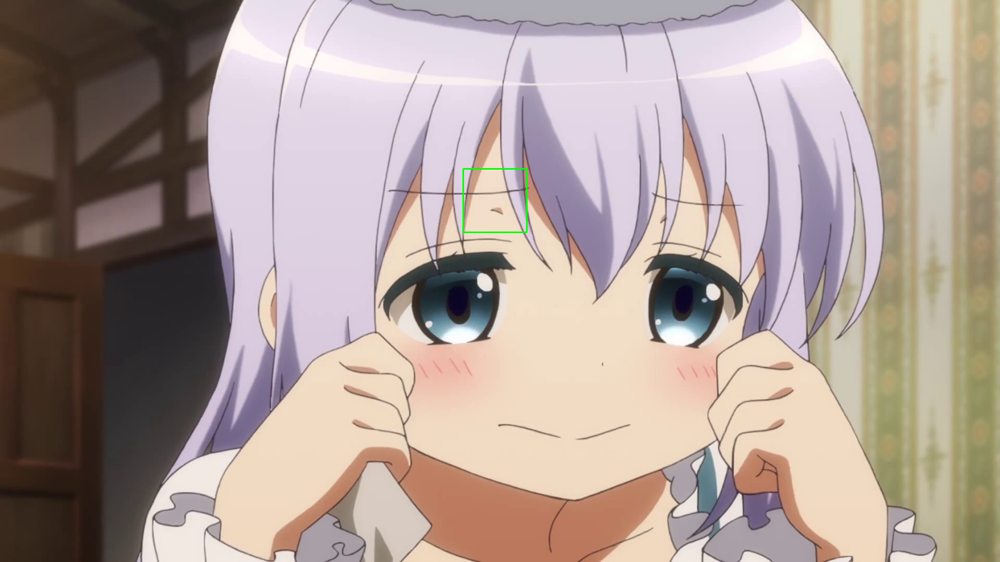
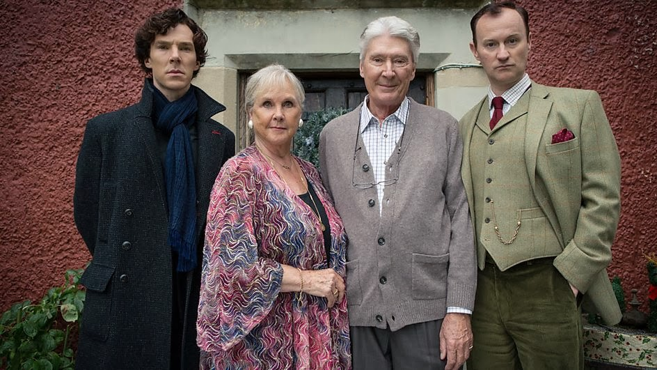
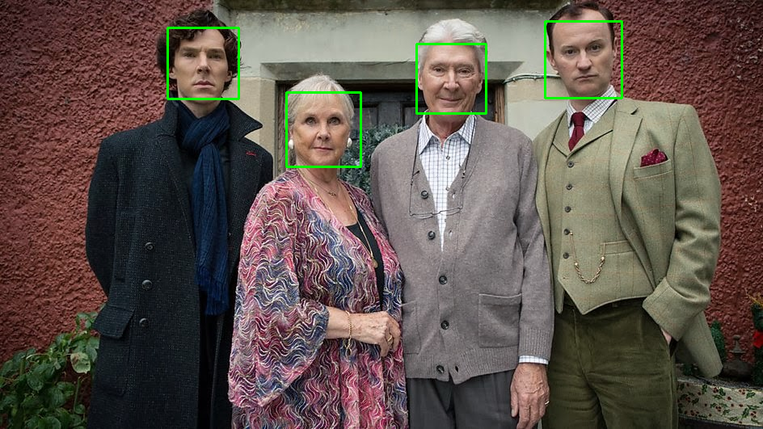
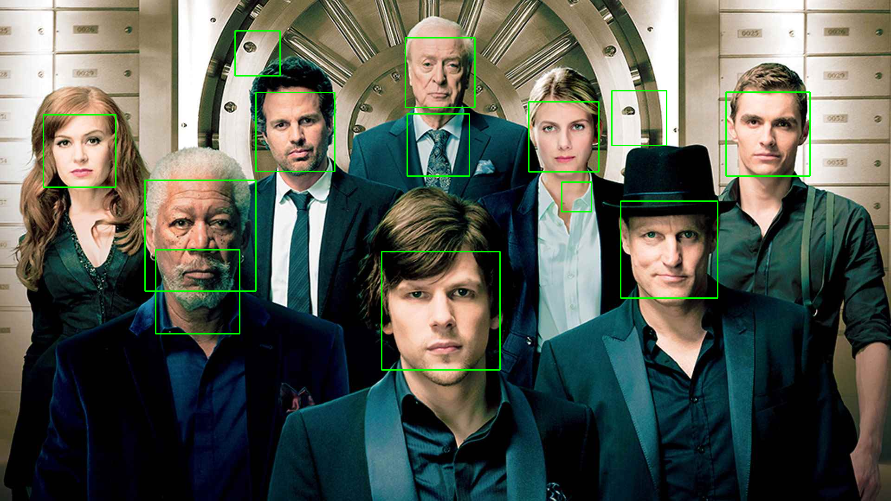
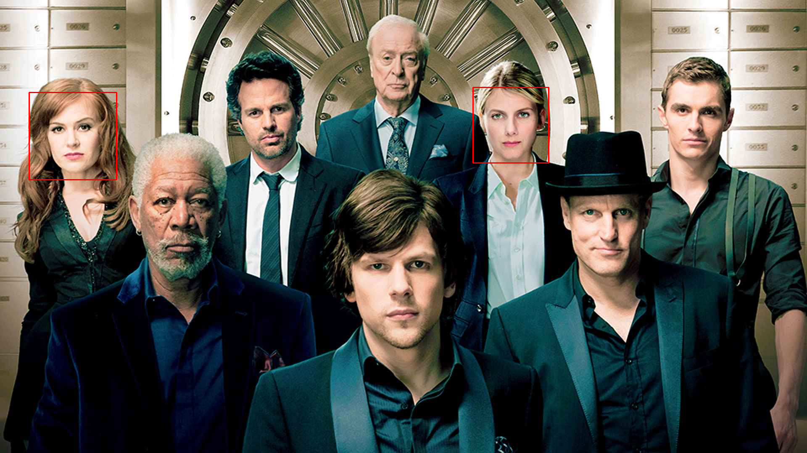
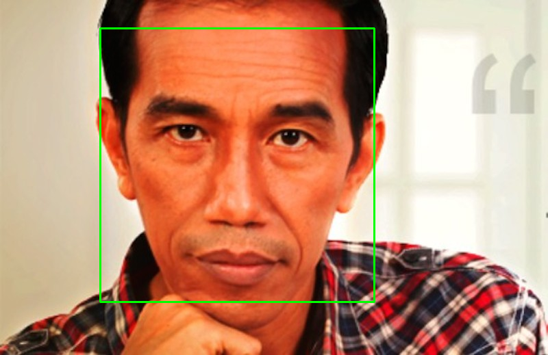

# OpenCV Playground

Freedomofkeima's OpenCV Playground, each projects and images are copyrighted to their respective owners.

FaceDetect: https://github.com/shantnu/FaceDetect

lbpcascade_animeface: https://github.com/nagadomi/lbpcascade_animeface

## Test Environment

- Ubuntu 16.04
- OpenCV 3.2.0

## Comparison

### Photo 1

Testcase:

FaceDetect (3D detector):

lbpcascade_animeface (2D detector):

### Photo 2

Testcase:

FaceDetect (3D detector):

lbpcascade_animeface (2D detector):

### Photo 3

Testcase:

FaceDetect (3D detector):

lbpcascade_animeface (2D detector):

### Photo 4

Testcase:

FaceDetect (3D detector):

lbpcascade_animeface (2D detector):

### Photo 5

Testcase:

FaceDetect (3D detector):

lbpcascade_animeface (2D detector):

### Photo 6

Testcase:

FaceDetect (3D detector):

lbpcascade_animeface (2D detector):

### Photo 7

Testcase:

FaceDetect (3D detector):

lbpcascade_animeface (2D detector):

### Photo 8

Testcase:

FaceDetect (3D detector):

lbpcascade_animeface (2D detector):

